## 1. Create a Virtual Private Cloud (VPC)
- #### GCP:
    Go to VPC network and create a new VPC network  
    Add subnet and hit Save
    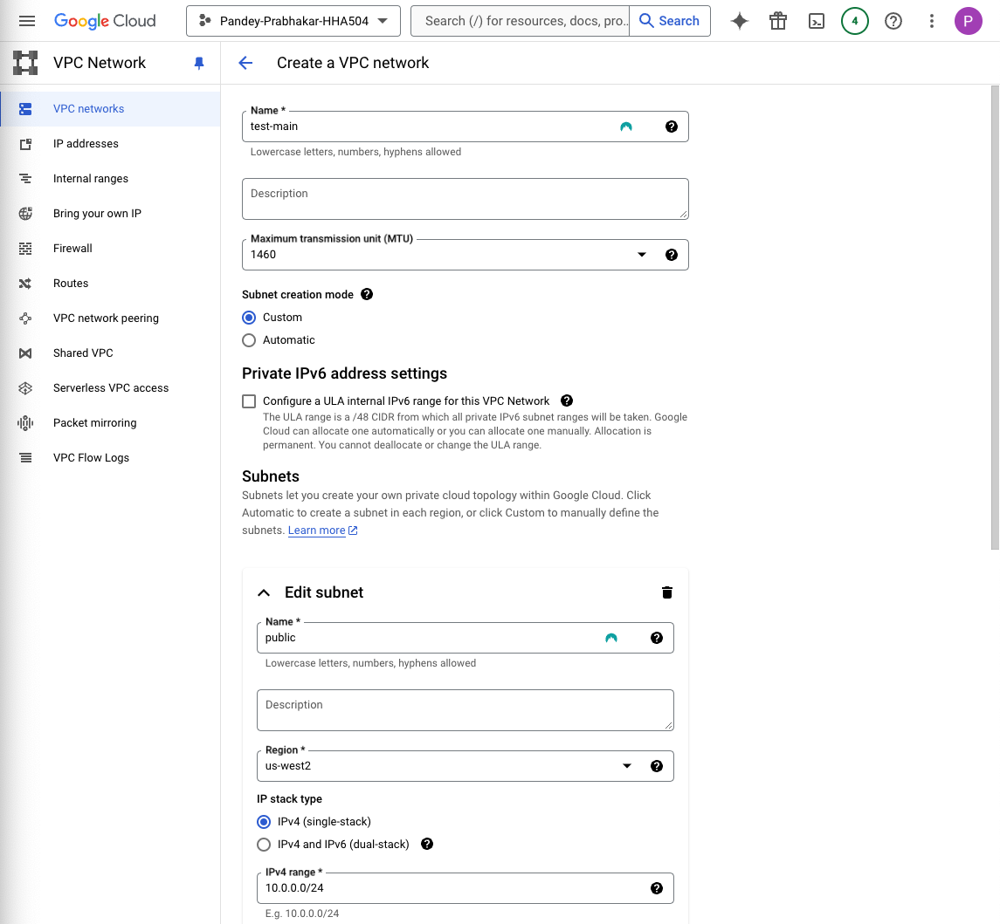
    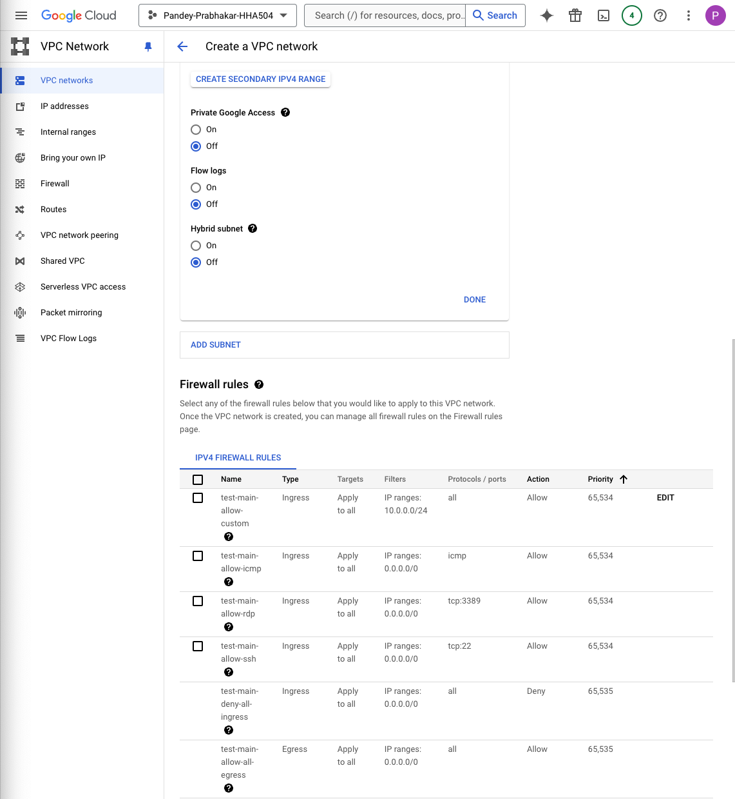

## 2. Assign a dedicated IP
- #### GCP:

     First, we reserve a static external IP    

    Go to **VPC Network > External IP addresses**  
    Click **Reserve static address** 
    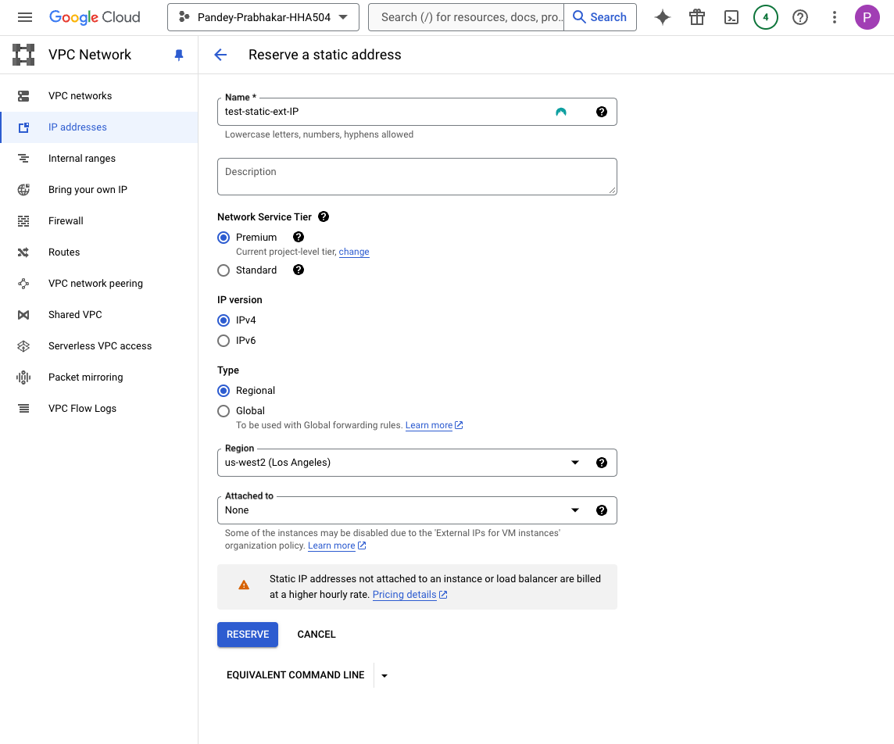

    Next, we will assign the static IP to a VM instance

    Go to **VM instances**  
    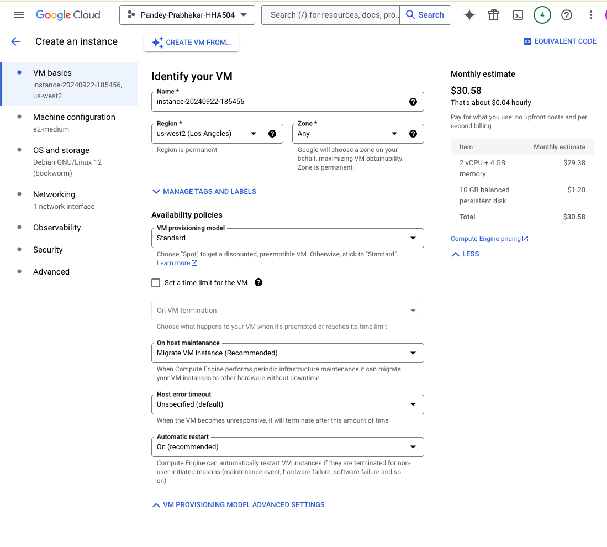
    Edit the instance  
    Go to **Network Interfaces** and choose your reserved IP under **External IP**
    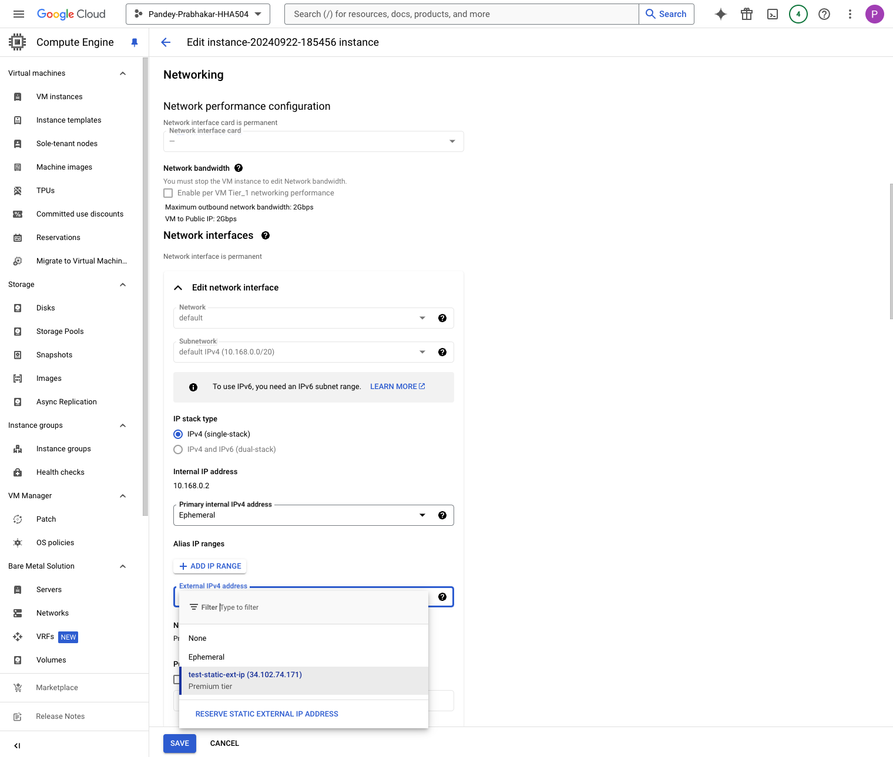

## 3. Map IP to a Domain
- #### GCP:

    Navigate to **Network Services > Cloud DNS**
    Click **Create Zone**
    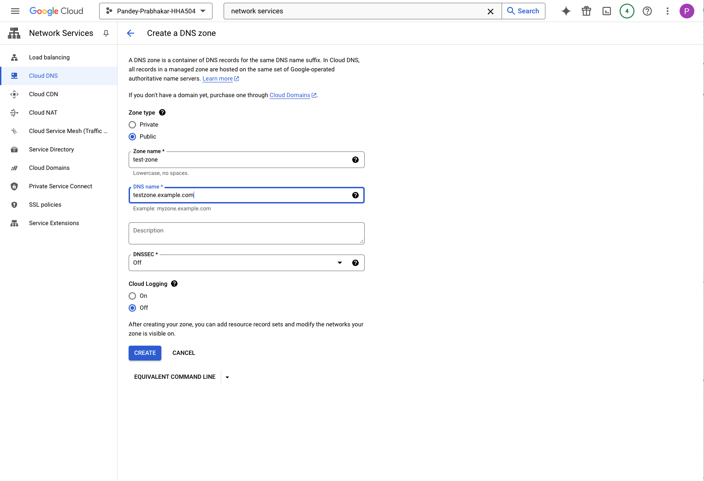

    Map IP to a domain name
    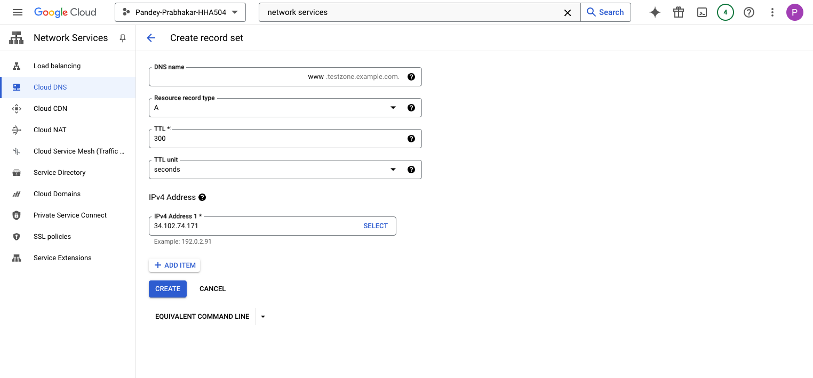
    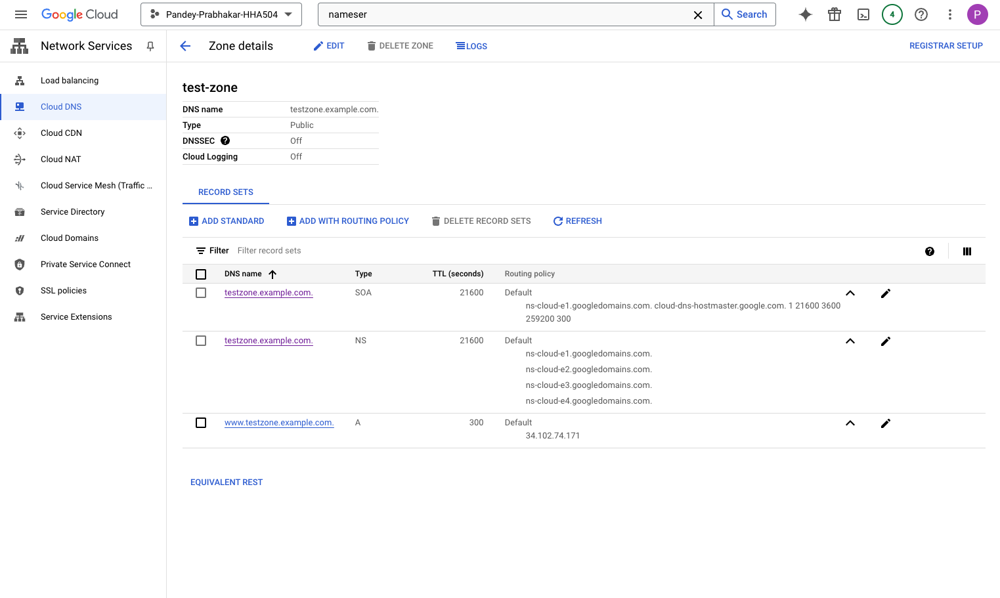

## 3. Explore VPN and Tunnels
- #### GCP:

    You will first need to ensure that you have your VPC networks ready

    Create VPN Gateway in each VPC
    

    Once done, you will create VPN tunnel in the VPN gateway of the first VPC
    
    It is important that the PSK is same for both sides. 

    Configure routing options and repeat the same steps for the second VPN Gateway

    You will also need to configure some firewall rules

    ### NEW VERSION OF ASSIGNMENT   

    - I started by creating a VM instance in GCP. 

    - Made sure that the OS was Ubuntu as it would have a lot of configurations installed already

    Also made sure that the firewall rule accepted port 5007

    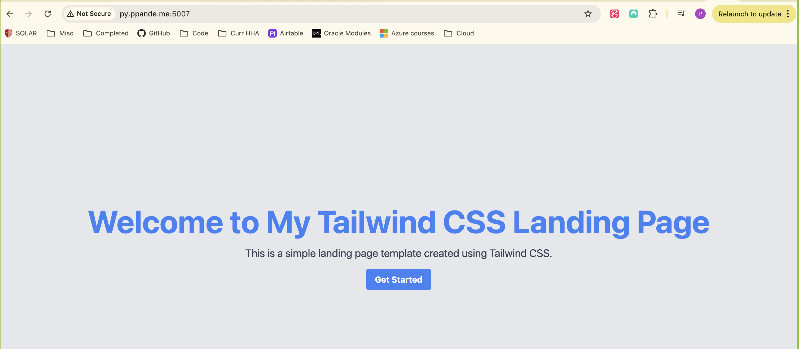

    ### AZURE
    I took a similar approach for Azure also

    - I began by creating a VM instance

    - Configured network settings to allow port 5007

    - I ran into issue initially and later realized that I needed a virtual environment

    - I created a virtual environmnet, installed the requirements file and ran app.py

    - It was successful however my page was still erroring out

    - I later realized that I had forgotten to switch the IP in namecheap to the Azure one. I had left the GCP IP there from before

    - After saving that, I was able to successfully see my page

    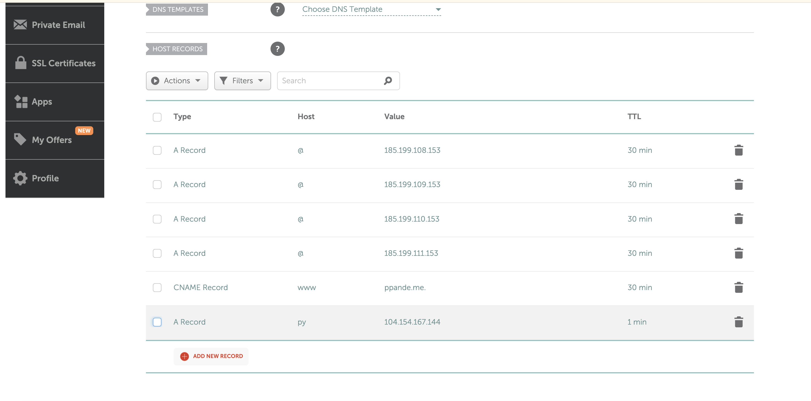
    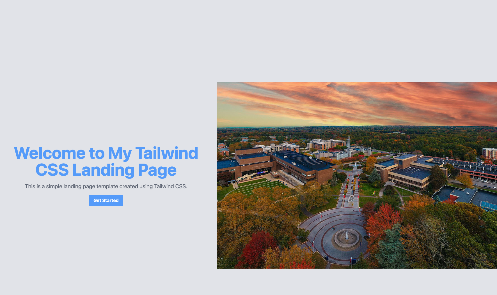
    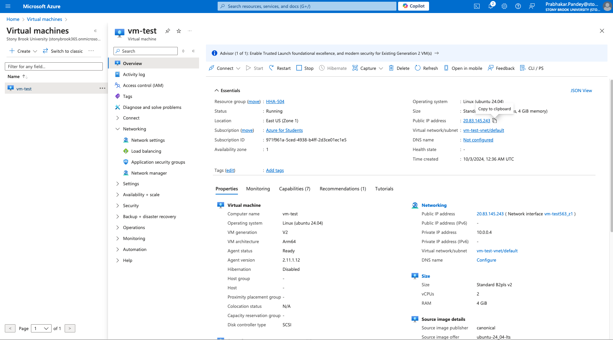
    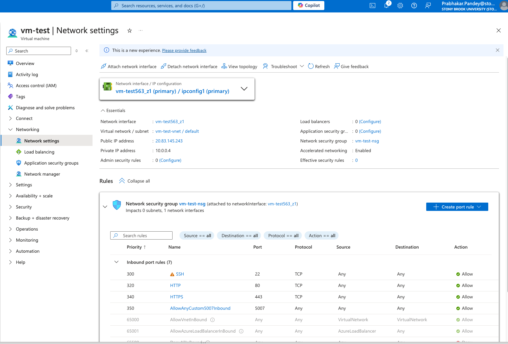